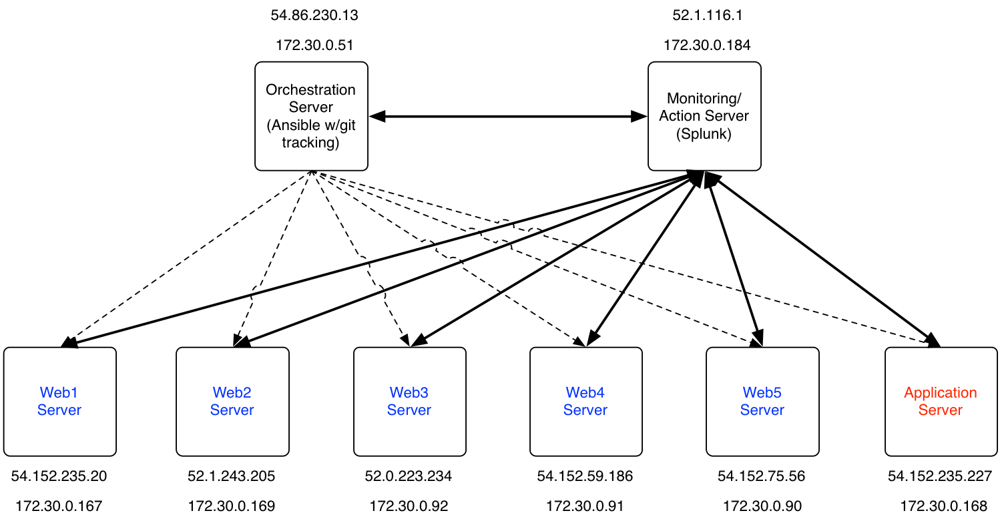

bsides-austin-2015
==================

This repo contains all the bits from the bsides austin talk 2015. 

## Demo Architecture

## Flow
* we detect new ports open on 3 host
* same host has 3 new processes (same) running on them
* 2 host are web servers behind out of a pool of 5 and are low priority
can be shutdown
* 1 host is an application server which we cannot shutdown because it will
impact operations
* we notice an alert from git saying we have uncommitted changes on our
orchestration sever (we are running git status in cron and writing it to a
file, ingesting file to Splunk)
* we confirm orchestration system configuration has been modified to
change iptables and allow new ports in also deployed a script/program to
all our hosts (new process we detected).
* we investigate our orchestration server further (get evidence) by
running sys dig and find a netcat process running (not an approved
process). 

